<!--
 * @Author: yyt-66 ethanye16@outlook.com
 * @Date: 2025-12-15 19:11:48
 * @LastEditors: yyt-66 ethanye16@outlook.com
 * @LastEditTime: 2025-12-16 12:18:11
 * @FilePath: /ws/P2S_Userguide_for_lab_of_FSII/README.md
 * @Description: 这是默认设置,请设置`customMade`, 打开koroFileHeader查看配置 进行设置: https://github.com/OBKoro1/koro1FileHeader/wiki/%E9%85%8D%E7%BD%AE
-->
# 🔧🖨️P2S_Userguide_for_lab_of_FSII
*A developer-oriented user manual for the Bambu P2S 3D printer, prepared for FSII. It introduces the printer’s structure, operation, safety, printing workflow, parameter tuning, material management, and advanced applications, adapted from official Bambu Lab documentation.*

---------

**本使用手册针对FSII课题组内部开发者使用，所有资料均来自拓竹官方。   
⚠️ 本打印机型号为P2S，目前未搭配AMS，请各位开发者注意甄别。**
## 📚产品资料 
[拓竹官网 bambu official website](https://bambulab.cn/zh-cn/p2s)  
[P2S新手入门官方课程](https://bambulab.cn/zh-cn/support/academy/12） 

| P2S-尺寸参数 | 打印尺寸（长 * 宽 * 高） |外形尺寸 |
| ----------- | :-----------: |:-----------: |
|      | 256 * 256 * 256 mm³      |392 * 406 * 478 mm³ |  

| 支持喷嘴直径 | 
| ----------- | 
|   0.2 mm、0.4 mm（标配）、0.6 mm、0.8 mm   |

| 支持打印板类型 | 
| ----------- | 
|   纹理 PEI 打印板（标配）、光面 PEI 打印板、增稳低温打印板  |

| 支持耗材类型 | 
| ----------- | 
|   PLA、PETG、ABS、ASA、TPU、Support for PLA、Support for PLA/PETG、Support for ABS、PET、PA、PC、PVA、PLA-CF、PETG-CF、ABS-GF、ASA-CF、PA6-CF、PA6-GF、PAHT-CF、PPA-CF、PET-CF   |
[官网耗材指南](https://bambulab.cn/zh-cn/filament-guide)
[耗材指南PDF（update20251215）](./doc/filament-guide-cn.pdf)

## 🔗快速上手
### 💾软件使用
**客户端使用规范**
（1）进入准备  
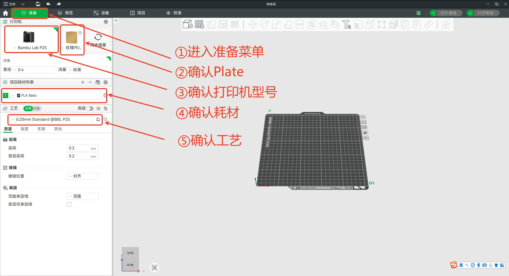
（2）导入模型  
拖入文件（3mf(推荐)、stl、step、等格式）
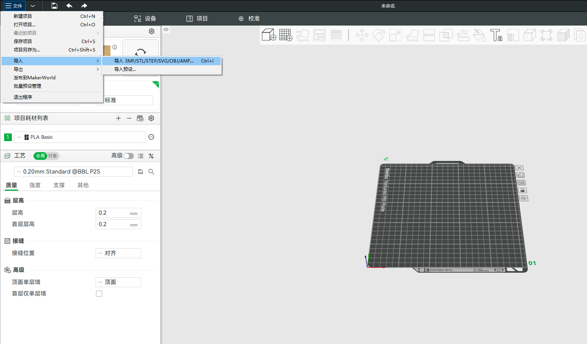
（3）调整打印对象  
自动配置（针对全局）：自动朝向、全局整理  
手动配置（针对单对象）：移动、旋转、缩放、选择底面（推荐尝试）等  
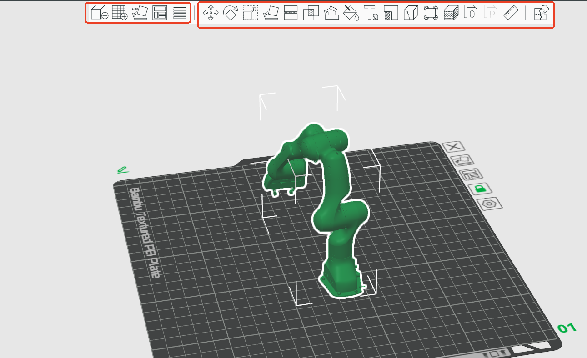
（4）设置打印参数  
两个关键参数（无特殊要求默认即可）
强层数：决定外墙硬度  
稀疏填充密度：决定内部强度
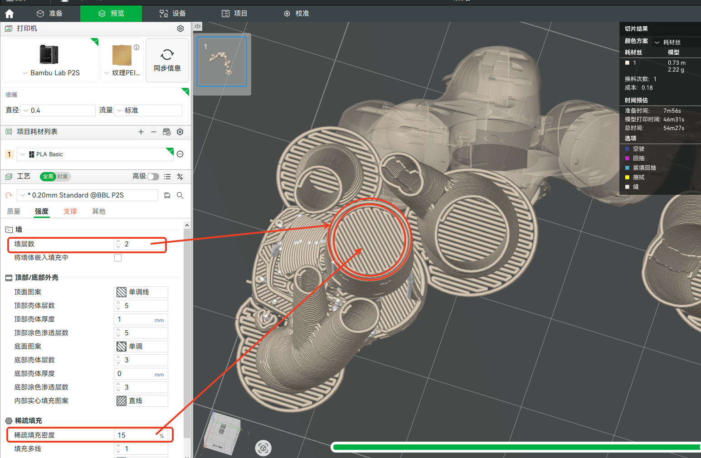
 ⚠️对于有悬空的物体，务必设置支撑  
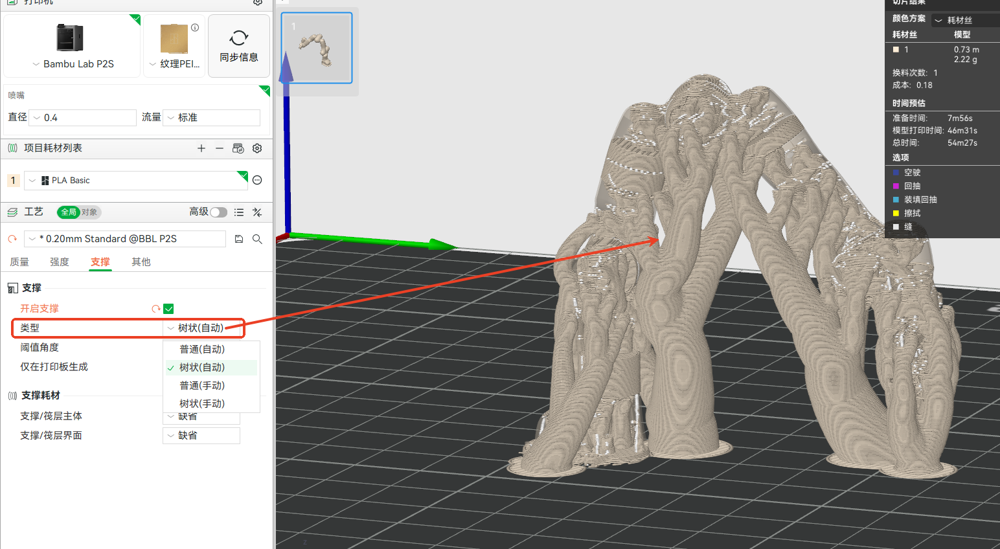
（5）切片单盘  
检查是否有warning  
检查耗材量和打印时间。
‼️请提前按照3D打印机上料规范进行手动上料
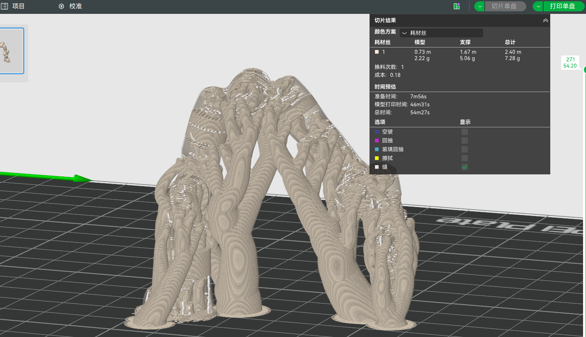
（6）发送打印
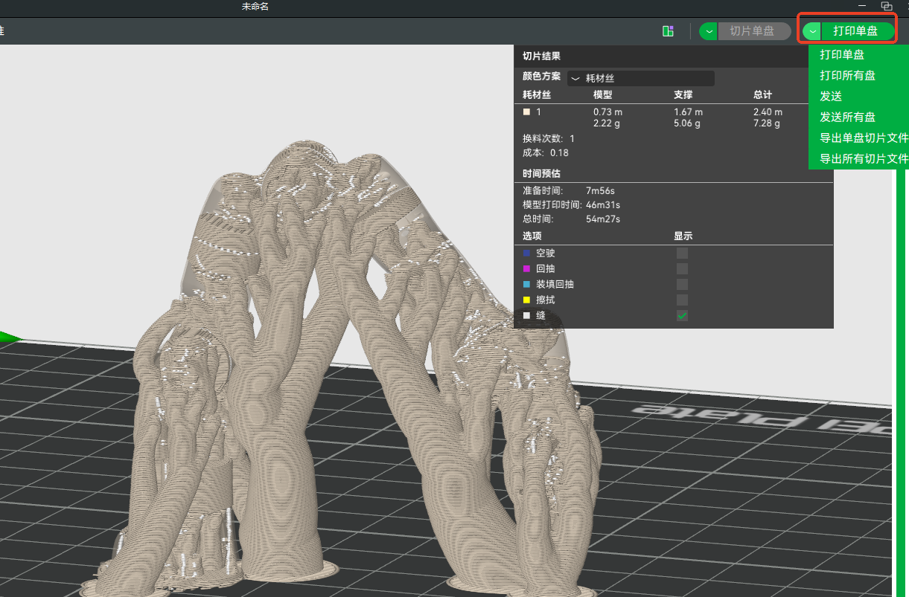  
（7）查看实时状态
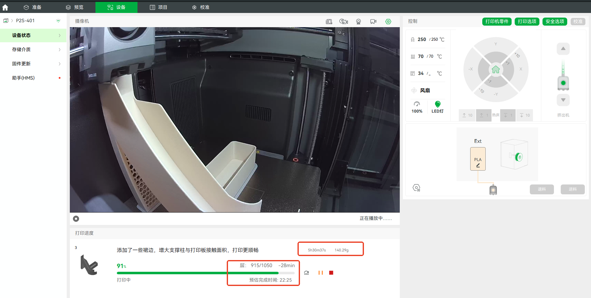
**打印机使用规范**  
（1）放置耗材  
将耗材线轴放置在外部支架上，并通过 PTFE 管将耗材引导至打印机背面的进料口。轻轻推动耗材，直到感受到阻力，这表示耗材已经到达挤出机。  
此时，您会注意到触摸屏上的挤出机图标变为绿色，说明耗材已经正确到位。  
（2）设置耗材信息  
进入触摸屏上的 “耗材” 菜单，轻触耗材图标，然后选择 “编辑” 进入编辑界面。  
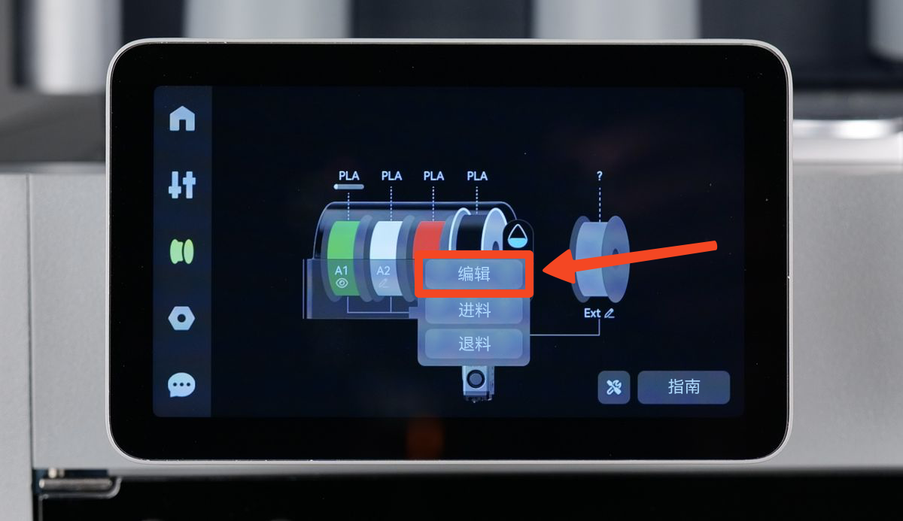
系统会提示你手动选择以下内容：  
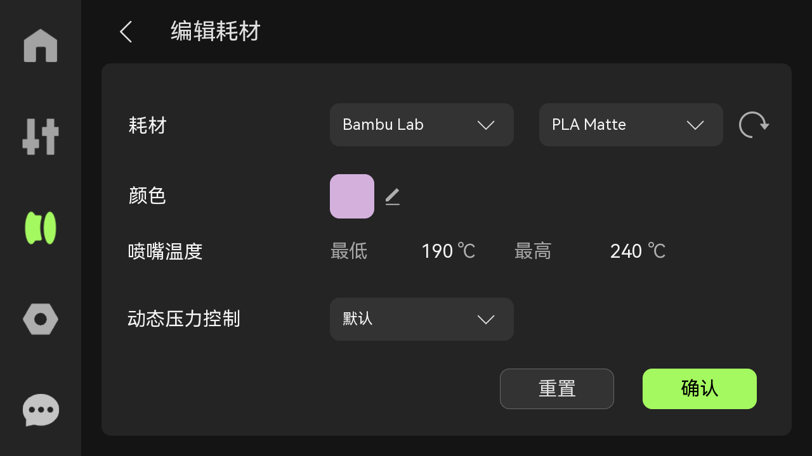  
a.耗材品牌 - 例如 eSun、Polymaker 等。
📌提示：如果您所用的耗材品牌未被列出，请选择 “Generic”，然后选择正确的类型和颜色。
b. 耗材类型 - 例如 PLA、ABS、PETG、TPU。
c. 耗材颜色 - 选择最接近的颜色，这样你的预览和材料追踪才会准确。  
（3）进料  
配置好耗材类型后，点击屏幕上的 “进料” 按钮，将耗材送入挤出机。此时，打印机将自动开始进料过程。热端会加热至合适的温度，挤出机齿轮开始转动，为后续的挤出做好准备。  
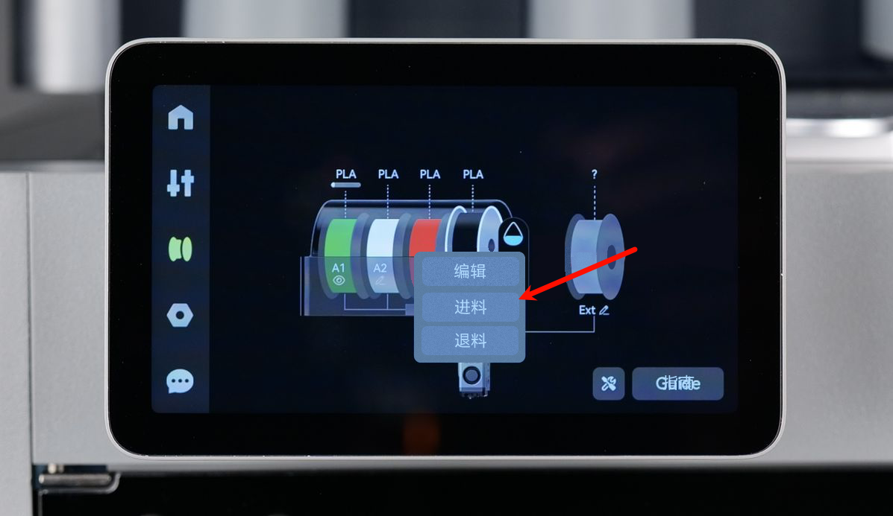 
根据打印机提示观察喷嘴。  
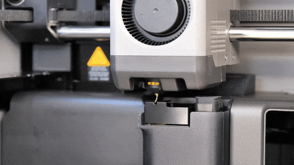 
看见喷嘴顺利挤出耗材后，在屏幕上点击 “耗材已挤出，继续”；如果耗材没有被挤出，选择“耗材未挤出，重试”，然后重复推入耗材的动作。  
🎉🎉耗材已成功装载，您可以开始打印了！
## ⚙️图纸与模型 
（TO DO）
## 🔍其他支持
💻 电脑端[Bambu Studio](https://bambulab.cn/zh-cn/download/studio)（win、mac、linux)   
📱 手机端[Bambu Handy](https://bambulab.cn/zh-cn/download/app)（App Store、Android可在应用商店搜索）  
🔧拓竹客服机器人  
https://support.bambulab.cn/cn?lang=zh-cn&from=6  
工单技术支持  
https://bambulab.cn/zh-cn/my/support/tickets/create  
issue、文档维护和技术支持请联系（wechat）  
+86-13958582557  